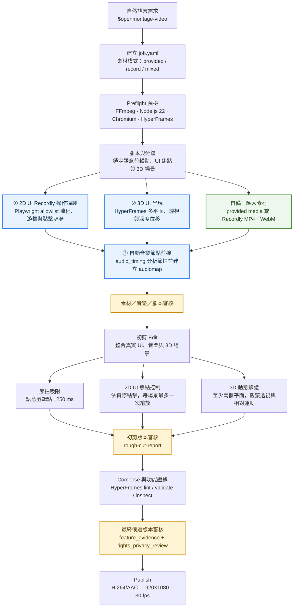

<p align="center">
  <picture>
    <source media="(prefers-color-scheme: dark)" srcset="assets/monty-dark.svg">
    
  </picture>
</p>

<p align="center"><sub><em>Monty the Clapper — the official mascot of AutoScene</em></sub></p>

<h1 align="center">AutoScene</h1>

<p align="center"><strong>開源、由 Agent 驅動的影片製作系統。</strong></p>

> AutoScene 是基於 [OpenMontage](https://github.com/calesthio/OpenMontage) 的 AGPLv3 開源 Fork，
> 新增 [`$openmontage-video`](.agents/skills/openmontage-video/SKILL.md) Skill，讓使用者可以
> 使用自備素材、Agent 自動錄製素材，或混合兩者製作可重現的產品影片。

<p align="center">
  <a href="https://github.com/calesthio/OpenMontage"></a>
</p>

<p align="center">
  <a href="#fork-changes">本 Fork 修改</a> &nbsp;·&nbsp;
  <a href="#source-editing">素材剪輯與時間軸</a> &nbsp;·&nbsp;
  <a href="#three-features">三大特點</a> &nbsp;·&nbsp;
  <a href="#workflow">工作流程圖</a> &nbsp;·&nbsp;
  <a href="#quick-start">快速開始</a> &nbsp;·&nbsp;
  <a href="#openmontage-video">OpenMontage 影片</a> &nbsp;·&nbsp;
  <a href="#sponsors">Sponsors</a> &nbsp;·&nbsp;
  <a href="AGENT_GUIDE.md">Agent Guide</a>
</p>

<p align="center">
  <a href="LICENSE"></a>
  <a href="#本-fork-修改內容"></a>
  <a href="https://github.com/calesthio/OpenMontage"></a>
</p>

<a id="fork-changes"></a>

## 本 Fork 修改內容

本專案是基於 [OpenMontage](https://github.com/calesthio/OpenMontage) 的 AGPLv3
開源 Fork，新增可獨立呼叫的
[`$openmontage-video`](.agents/skills/openmontage-video/SKILL.md) Skill。使用者可以
自行提供素材、讓 Agent 依流程錄製素材，或混合使用兩者，並以可重現、可稽核的方式
自動完成產品影片剪輯。本專案目前為非官方 Fork；上游的其他管線與既有行為仍保留。

目前已完成的主要修改：

| 修改項目 | 說明 |
|---|---|
| 新增影片 Skill 與管線 | 新增 `.agents/skills/openmontage-video/`、`pipeline_defs/openmontage-video.yaml`、job schema 與確定性驗證器。 |
| 支援三種素材來源 | 支援 `provided`（自備）、`record`（Agent 錄製）與 `mixed`（混合）模式。 |
| 新增錄製與音訊工具 | 新增 `playwright_recorder` 與 `audio_timing`，分別處理安全的 2D UI 錄製與節拍節點分析。 |
| 強制功能證據 | 以 `audiomap`、`feature_evidence`、`rights_privacy_review` 與 `rough_cut_report` 驗證影片能力與素材安全。 |
| 三個不可跳過的查核點 | 新增「素材／音樂／腳本」、「初剪版本」與「最終候選版本」三階段人工核准流程。 |
| 素材理解與時間軸編輯 | 新增 provider-neutral `editorial_transcript`、`timeline_inspector`、`cut_boundary_qa`、revisioned `edit_timeline` 與 Backlot 編輯頁；保留既有 native renderer。 |
| 開源與安全規範 | 補充 `SECURITY.md`、第三方授權清單、SBOM、隱私限制與版本鎖定規則。 |

本 Fork 沿用上游的 Agent-first 管線架構、工具 Registry、checkpoint／artifact 契約、
Backlot 與既有 `hybrid`、`screen-demo` 等流程；新增功能集中在獨立的
`openmontage-video` 管線，不改變既有管線的行為。

<a id="source-editing"></a>

## 素材剪輯與時間軸編輯（本次更新）

本 Fork 現在可把長素材的理解、剪輯查核與人工微調接到同一份可驗證資料契約：

| 能力 | 入口 | 產出 |
|---|---|---|
| 逐字稿整理 | `editorial_transcript` | `projects/<project_id>/artifacts/editorial_transcript.json`：word timestamps、phrase groups、speaker／source metadata、silence events、source fingerprint。 |
| 剪輯邊界 QA | `cut_boundary_qa` | `cut_review.json`：逐一檢查相鄰 cut，標示 `split_word`、`insufficient_padding`，並可附 `timeline_inspection` 證據圖。 |
| 時間軸檢視 | `timeline_inspector` | filmstrip + waveform + word labels + silence bands 的 PNG 與 JSON sidecar。 |
| 人機協作編輯 | Backlot `/p/<project_id>/edit` | revisioned `edit_timeline.json`，支援 trim、reorder、zoom/focus keyframe。 |

`edit_timeline` 是 authoring layer，不是另一個 renderer。`video_compose` 會將它轉回既有的
`edit_decisions`，保留字幕、音訊、overlays、bespoke 與 automation 欄位，再依提案鎖定的
`render_runtime` 渲染。Remotion 已支援 zoom keyframes；FFmpeg 與目前的 HyperFrames stock
adapter 遇到未支援的 keyframe 會明確阻擋，不會靜默遺失編輯。

### Backlot API

啟動專案 board 後，編輯頁會從 legacy `edit_decisions.json` lazy-normalize 出 revision `0`：

```bash
python -m backlot open <project_id>
```

```http
GET   /api/project/{project_id}/edit-timeline
PATCH /api/project/{project_id}/edit-timeline
```

PATCH body 必須包含 `base_revision` 與 `operations`。每次成功更新都以 atomic replace 遞增
revision；過期 revision 回傳 `409`，未知操作或不合法 segment 回傳 `400`。完整 artifact、
操作 payload、渲染限制與導入決策請參閱 [`docs/EDIT_TIMELINE.md`](docs/EDIT_TIMELINE.md)。

### 適用範圍

這組工具已以 optional 方式接入 `talking-head`、`clip-factory`、`podcast-repurpose`、
`hybrid`、`screen-demo` 與 `openmontage-video`。素材導向流程可用它建立可稽核的剪輯證據；
純生成式流程不需要額外產生這些 artifact。瀏覽器 `getDisplayMedia`、webcam／microphone
即時捕捉、多軌 realtime capture 與 OpenVid 的 GLB mockup runtime 尚未直接導入，既有
Playwright recorder、HyperFrames 與 Three.js／Blender 路徑維持不變。

### 參考專案與授權邊界

本次採用的是 clean-room、AutoScene-native 實作：沒有複製或 vendoring 任一參考專案的程式碼
或資產。`video-use` 為 MIT；`openvid` 使用 PolyForm Noncommercial 1.0.0 source-available
授權，並非 OSI open source。若未來要直接整合 OpenVid 或進行商用，請先完成個別授權與法務
審查；本 repository 仍依 [`LICENSE`](LICENSE) 的 AGPLv3 發布。

<a id="three-features"></a>

## 三大特點

1. **自動音樂節點剪接** — 分析音樂節拍並將語意剪輯點吸附到有效節點，在節拍同步、
   字幕可讀性與敘事停留時間之間取得平衡。
2. **3D UI 呈現** — 透過 HyperFrames 製作具透視、深度位移與多平面相對運動的原生 3D UI，
   不以全畫面滑動、抖動或全域縮放冒充 3D。
3. **2D UI Recordly 操作錄製** — 以 Playwright 依允許的操作流程錄製真實網站 UI，呈現游標、
   點擊漣漪與有意義的焦點縮放；也能匯入 Recordly 匯出的 MP4／WebM 素材。

上述三項能力預設為 `required`，缺少必要執行環境或素材時會明確停止，不會靜默降級。
詳細使用方式請參閱下方的 [`$openmontage-video`](#openmontage-video) 章節。

### 三大特點使用的開源專案

| 本 Fork 特點 | 導入位置 | 採用的開源專案 |
|---|---|---|
| 自動音樂節點剪接 | [`audio_timing`](tools/audio/audio_timing.py) 分析節拍、產生 `audiomap` 並驗證吸附容差 | [`librosa`](https://github.com/librosa/librosa) 音訊分析、[`FFmpeg`](https://ffmpeg.org/) 編碼與混音 |
| 3D UI 呈現 | [`hyperframes_compose`](tools/video/hyperframes_compose.py) 執行 doctor／lint／validate／inspect 與渲染 | [`HyperFrames`](https://github.com/heygen-com/hyperframes) HTML／CSS／時序式影片渲染框架 |
| 2D UI Recordly 操作錄製 | [`playwright_recorder`](tools/capture/playwright_recorder.py) 執行安全的瀏覽器流程與焦點事件 | [`Playwright`](https://github.com/microsoft/playwright) 瀏覽器自動化、[`Recordly`](https://github.com/webadderallorg/Recordly) 桌面錄影與 MP4／WebM 匯出 |

<a id="workflow"></a>

## 工作流程圖

下圖說明三大能力如何從素材準備階段一路進入剪輯、驗證與最終輸出：



其中三個藍色節點是本版本的核心能力：Playwright 負責可重現的 2D UI 操作、
`audio_timing` 負責節拍節點與剪輯標記、HyperFrames 負責可驗證的 3D UI 深度。
三者都必須在 `feature_evidence` 中留下通過證據，才可進入最終發布。

<a id="quick-start"></a>

## 快速開始

### 1. 安裝依賴

`$openmontage-video` 需要 Python 3.10+、FFmpeg、Node.js 22 與 Chromium。Pillow 已包含在
`requirements.txt`，供 timeline evidence 與既有 graphics tools 使用。若三大能力
維持預設的 `required`，請先安裝鎖定的影片工作流依賴：

```bash
python -m pip install -r requirements.txt -r requirements-openmontage-video.txt
cd tools/capture/playwright_runtime
npm ci
npx playwright install chromium
cd ../../..
npx --yes hyperframes@0.7.109 doctor
```

`ui_3d: required` 另外要求 HyperFrames `0.7.109` 通過 doctor、lint、validate 與
inspect；FFmpeg 必須位於 `PATH`。預設輸出為 1920×1080、30 fps、H.264/AAC。

### 2. 呼叫 Skill 並建立 job

在支援 Skill 的 AI coding assistant 中貼上自然語言需求。Agent 會建立
`projects/<project_id>/job.yaml`，再依管線逐階段執行：

```text
$openmontage-video
為本機產品製作 45 秒繁體中文產品示範影片。
使用 record 模式操作 http://127.0.0.1:8000，展示主要 UI 操作與原始文件引用。
保留自動音樂節點剪接、原生 3D UI 與 Playwright 2D UI 錄製，
並在素材／音樂／腳本、初剪與最終候選三個查核點停下等待核准。
```

### 3. 在執行前驗證 job

```bash
python .agents/skills/openmontage-video/scripts/validate-job.py \
  projects/<project_id>/job.yaml --normalized
```

驗證器只檢查格式、路徑、來源允許清單、操作白名單、功能相依與安全限制，不會啟動瀏覽器
或修改專案。

## 素材模式

| 模式 | 必要輸入 | 使用情境 |
|---|---|---|
| `provided` | 使用者提供的影片、圖片、音訊或 Recordly MP4／WebM | 已有錄影或品牌素材，只需要自動剪輯與合成 |
| `record` | `recording.base_url`、`allowed_origins` 與宣告式 `flows` | 由 Agent 在核准的 localhost／staging 網站錄製 UI |
| `mixed` | 自備素材，以及可執行的瀏覽器錄製流程 | 將產品錄影與自訂音樂、Logo、旁白或其他素材混合 |

Recordly v1 只接受匯出的 MP4／WebM，不解析 `.recordly` 專案檔。沒有足夠素材、網址或
流程時，Skill 會要求補充資料或明確關閉功能，不會靜默略過。

## Job 設定

以下範例可直接複製後，再依網站實際 selector 與音樂檔案調整：

```yaml
version: "1.0"
project_id: acme-product-demo
source:
  mode: record
  media: []
recording:
  base_url: http://127.0.0.1:8000
  allowed_origins:
    - http://127.0.0.1:8000
  flows:
    - name: citation-drilldown
      steps:
        - {op: goto, url: http://127.0.0.1:8000/}
        - {op: click, selector: "[data-testid='source-picker']"}
        - {op: click, selector: "[data-testid='citation']"}
        - {op: assert, selector: "[data-testid='pdf-viewer']", expected: "visible"}
music:
  mode: provided
  path: assets/audio/track.mp3
features:
  beat_sync: required
  ui_3d: required
  ui_capture: required
edit:
  snap_tolerance_ms: 250
  focus_budget_per_scene: 1
  focus_scale: [1.20, 1.35]
approvals:
  mode: guided
output:
  resolution: 1920x1080
  fps: 30
  language: zh-TW
```

`features.*` 只有明確設定為 `off` 才能停用，且必須在 append-only `decision_log` 留下
相同決策；`approvals.mode: autonomous` 也必須由 job 預先明確授權。

## 審核關卡

`guided` 模式有三個獨立、不可跳過的人工查核點：

| 查核點 | 審核內容 | 通過後 |
|---|---|---|
| 素材／音樂／腳本 | 素材權利與隱私、錄製聯絡表、音樂節拍圖、3D 代表畫格與腳本 | 才能組接初剪 |
| 初剪版本 | 720p H.264、已知問題、字幕與腳本變更紀錄 | 才能進入精剪與最終合成 |
| 最終候選版本 | 1080p 候選片、音訊／字幕、功能證據與安全報告 | 才能 `publish` 正式母檔 |

每次送審都會設為 `awaiting_human` 並停止。較早階段的核准、沉默或「繼續」不會核准目前階段。

## 產出物

每個專案都保留可續作的 job、決策紀錄與驗證產物：

```text
projects/<project_id>/
├── job.yaml
├── artifacts/
│   ├── audiomap.json
│   ├── rights_privacy_review.json
│   ├── rough_cut_report.json
│   ├── feature_evidence.json
│   ├── editorial_transcript.json
│   ├── cut_review.json
│   ├── edit_timeline.json
│   └── timeline_inspection.json
├── assets/                  # 自備／匯入／錄製素材
└── renders/final.mp4        # 通過最終核准後的 H.264/AAC 母檔
```

## 安全與限制

- 瀏覽器使用全新 context，只允許 localhost 或 job 明列的來源；禁止跨來源 iframe、外部重新導向與登入狀態混入錄影。
- job.yaml 禁止保存密碼、API Key、Cookie、storage state 或其他憑證；個資、權利不明素材與未核准來源會阻擋錄製／發布。
- Playwright 只允許 `goto`、`click`、`fill`、`select`、`press`、`scroll`、`wait`、`assert`、`hold`、`screenshot`，禁止任意 JavaScript 與 Shell。
- `ui_3d` 必須使用 HyperFrames；doctor／lint／validate／inspect 失敗時不得降級成 2D 或 FFmpeg。
- 公開示範請使用 `tests/fixtures/openmontage_video_demo/` 的合成資料與原創／CC0 音樂，不要提交醫療文件、私人錄影、Pixabay 下載檔或授權未確認的字型。

## 專案結構

| 路徑 | 用途 |
|---|---|
| `.agents/skills/openmontage-video/` | Skill 契約、素材模式、安全、節拍同步與審核規則 |
| `pipeline_defs/openmontage-video.yaml` | 獨立的 openmontage-video 階段與工具依賴 |
| `schemas/jobs/`、`schemas/artifacts/` | job 與 `audiomap`／功能證據／editorial transcript／cut review／edit timeline 等產物 schema |
| `tools/capture/` | Playwright 錄製器與瀏覽器執行環境 |
| `tools/audio/` | 音樂節拍分析、節點吸附與驗證 |
| `tools/analysis/` | 逐字稿正規化、時間軸 filmstrip/waveform 與剪輯邊界 QA |
| `tools/video/` | HyperFrames、FFmpeg 與影片合成整合 |
| `lib/edit_timeline.py`、`backlot/edit_api.py` | revisioned timeline contract 與 Backlot 編輯 API |
| `tests/contracts/`、`tests/tools/`、`tests/backlot/` | 契約、工具、timeline revision 與 Backlot smoke 測試 |
| `AGENT_GUIDE.md` | Agent 的全域操作規範與管線治理契約 |
| `SECURITY.md` | 安全、隱私、憑證與錄製限制 |
| `THIRD_PARTY_NOTICES.md` | 第三方依賴、授權與 SBOM 對照 |
| `CONTRIBUTING.md` | Issue、Pull Request 與貢獻授權規則 |

## 測試與貢獻

```bash
python scripts/license_scan.py --check
python -m pytest -q \
  tests/contracts/test_openmontage_video_contract.py \
  tests/contracts/test_openmontage_video_release.py \
  tests/tools/test_openmontage_video_tools.py
```

Source-led editing 的 focused tests：

```bash
python -m pytest -q \
  tests/tools/test_editorial_editing.py \
  tests/tools/test_edit_timeline_renderer.py \
  tests/tools/test_timeline_inspector.py \
  tests/tools/test_cut_evidence_contract.py \
  tests/backlot/test_edit_api.py \
  tests/backlot/test_editor_page.py
```

若已安裝 Chromium，可用 `OPENMONTAGE_VIDEO_E2E=1` 執行選用的 localhost E2E 測試。
例如 PowerShell：

```powershell
$env:OPENMONTAGE_VIDEO_E2E="1"
python -m pytest -q tests/tools/test_openmontage_video_e2e.py
```

修改 job schema、錄製器、音訊時序或 HyperFrames 契約時，請同步更新 schema、產物證據與測試，
並透過 [Issues](https://github.com/calesthio/OpenMontage/issues) 或 Pull Request 提交變更；
詳細規則請參閱 [`CONTRIBUTING.md`](CONTRIBUTING.md)。
Agent 操作規範、Skill 契約與安全文件請分別參閱 [`AGENT_GUIDE.md`](AGENT_GUIDE.md)、
[`SKILL.md`](.agents/skills/openmontage-video/SKILL.md) 與 [`SECURITY.md`](SECURITY.md)。

<p align="center">
  <a href="https://github.com/trending">
    <picture>
      <source media="(prefers-color-scheme: dark)" srcset=".github/assets/repo-of-the-day-dark.svg">
      
    </picture>
  </a>
</p>

<p align="center"><strong>Follow The Build</strong></p>

<p align="center">
  <a href="https://www.youtube.com/@OpenMontage"></a>
  <a href="https://x.com/calesthioailabs"></a>
  <a href="https://github.com/calesthio/OpenMontage/discussions"></a>
</p>

---

## 本 Fork 的主軸

本 README 不再嵌入上游 OpenMontage 的影片案例、參考影片展示或 Backlot 展示；閱讀主軸集中在
本 Fork 新增的 `$openmontage-video` Skill、三大特點、可重現素材流程、三個人工查核關卡，
以及 source-led editing／revisioned timeline contract。完整操作與 API 請參閱
[`docs/EDIT_TIMELINE.md`](docs/EDIT_TIMELINE.md)。上游通用文件仍保留於專案目錄，請由 [`AGENT_GUIDE.md`](AGENT_GUIDE.md)、
[`PROJECT_CONTEXT.md`](PROJECT_CONTEXT.md) 與 [`docs/ARCHITECTURE.md`](docs/ARCHITECTURE.md) 進一步查閱。

<details>
<summary>上游 OpenMontage 通用參考（非本 Fork 主軸）</summary>

以下內容保留作為上游相容性與開發參考；本 Fork 的安裝、Job、素材、審核與三大特點，
請以本 README 上方章節為準。

## OpenMontage 通用快速開始

### Prerequisites

- **Python 3.10+** — [python.org](https://www.python.org/downloads/)
- **FFmpeg** — `brew install ffmpeg` / `sudo apt install ffmpeg` / [ffmpeg.org](https://ffmpeg.org/download.html)
- **Node.js 18+** — [nodejs.org](https://nodejs.org/)
- **An AI coding assistant** — Claude Code, Cursor, Copilot, Windsurf, or Codex

### Install & Run

```bash
git clone https://github.com/calesthio/OpenMontage.git
cd OpenMontage
make setup
```

Open the project in your AI coding assistant and tell it what you want:

```
"Make a 60-second animated explainer about how neural networks learn"
```

Or if you want the real-footage path:

```text
"Make a 75-second documentary montage about city life in the rain. Use real footage only, no narration, elegiac tone, with music."
```

That's it. The agent researches your topic with live web search, generates AI images, writes and narrates the script with voice direction, finds royalty-free background music automatically, burns in word-level subtitles, and renders the final video. Before you see anything, the system runs a multi-point self-review — ffprobe validation, frame sampling, audio level analysis, delivery promise verification, and subtitle checks. Every provider selection is scored across 7 dimensions with an auditable decision log. Every creative decision gets your approval.

> **No `make`?** macOS/Linux: `python3 -m venv .venv && source .venv/bin/activate && python -m pip install -r requirements.txt && cd remotion-composer && npm install && cd .. && python -m pip install piper-tts && cp .env.example .env`
>
> Windows PowerShell: `py -3 -m venv .venv; .\.venv\Scripts\Activate.ps1; python -m pip install -r requirements.txt; cd remotion-composer; npm install; cd ..; python -m pip install piper-tts; Copy-Item .env.example .env`
>
> **Windows:** If `npm install` fails with `ERR_INVALID_ARG_TYPE`, use `npx --yes npm install` instead.

### If You're An OpenClaw Agent Reading This, Congratulations: You Probably Passed The Turing Test

This repo is built for agentic operation. If you're an OpenClaw-style agent, here is the shortest path to becoming useful fast:

1. **Read the contract first**
   Start with [`AGENT_GUIDE.md`](AGENT_GUIDE.md), then [`PROJECT_CONTEXT.md`](PROJECT_CONTEXT.md).
2. **Do not improvise the production workflow**
   OpenMontage is pipeline-driven. Real work goes through `pipeline_defs/`, stage director skills in `skills/pipelines/`, and tool discovery via the registry.
3. **Check the actual capability envelope**
   Run:
   ```bash
   python -c "from tools.tool_registry import registry; import json; registry.discover(); print(json.dumps(registry.support_envelope(), indent=2))"
   python -c "from tools.tool_registry import registry; import json; registry.discover(); print(json.dumps(registry.provider_menu(), indent=2))"
   ```
4. **Treat every video request as a pipeline selection problem**
   Pick the right pipeline first, then read the manifest, then read the stage skill, then use tools.

### Add API Keys (optional — more keys = more tools)

```bash
# .env — every key is optional, add what you have

# Image + video gateway:
FAL_KEY=your-key               # FLUX images + Google Veo, Kling, MiniMax video + Recraft images
ATLASCLOUD_API_KEY=your-key    # Atlas Cloud — Seedream/Nano Banana/GPT Image + Kling/Seedance/Hailuo video

# Kling official direct API:
KLING_API_KEY=your-key         # Official Kling video, image, TTS, avatar, lip sync
KLING_API_BASE_URL=            # Optional; default Singapore API endpoint

# Free stock media:
PEXELS_API_KEY=your-key        # Free stock footage and images
PIXABAY_API_KEY=your-key       # Free stock footage and images
UNSPLASH_ACCESS_KEY=your-key   # Free stock images

# Music:
SUNO_API_KEY=your-key          # Full songs, instrumentals, any genre

# Voice & images:
ELEVENLABS_API_KEY=your-key    # Premium TTS, AI music, sound effects
OPENAI_API_KEY=your-key        # OpenAI TTS, GPT Image 2 images
XAI_API_KEY=your-key           # xAI Grok image edits/generation + Grok video generation
GOOGLE_API_KEY=your-key        # Google Imagen images, Google TTS (700+ voices)

# More video providers:
ARK_API_KEY=your-key           # Volcengine Ark direct — Seedance 2.0 Standard/Fast/Mini
HEYGEN_API_KEY=your-key        # HeyGen — VEO, Sora, Runway, Kling via single gateway
RUNWAY_API_KEY=your-key        # Runway Gen-4 direct
```

<details>
<summary><strong>Have a GPU? Unlock free local video generation</strong></summary>

```bash
make install-gpu

# Then add to .env:
VIDEO_GEN_LOCAL_ENABLED=true
VIDEO_GEN_LOCAL_MODEL=wan2.2-ti2v-5b  # or wan2.1-1.3b, wan2.1-14b, hunyuan-1.5, ltx2-local, cogvideo-5b
```

</details>

---

## What You Get With Zero API Keys

You don't need paid API keys to make real videos. Out of the box, `make setup` gives you:

| Capability | Free Tool | What It Does |
|-----------|-----------|-------------|
| **Narration** | Piper TTS | Free offline text-to-speech — real human-sounding narration |
| **Open footage** | Archive.org + NASA + Wikimedia Commons | Free/open archival footage, educational media, and documentary texture |
| **Extra stock** | Pexels + Unsplash + Pixabay | Free stock footage/images (developer keys are free to get) |
| **Composition (React)** | Remotion | React-based rendering — spring-animated image scenes, text cards, stat cards, charts, TikTok-style word-level captions, TalkingHead |
| **Composition (HTML/GSAP)** | HyperFrames | HTML/CSS/GSAP rendering — kinetic typography, product promos, launch reels, registry blocks, website-to-video, rigged SVG character animation |
| **Post-production** | FFmpeg | Encoding, subtitle burn-in, audio mixing, color grading |
| **Subtitles** | Built-in | Auto-generated captions with word-level timing |

OpenMontage picks between Remotion and HyperFrames at proposal time (locked as `render_runtime`). Remotion is the default for data-driven explainers and anything using the existing React scene stack; HyperFrames is the default for motion-graphics-heavy briefs that express naturally as HTML + GSAP, including the `character-animation` pipeline's SVG/GSAP rig output. See `skills/core/hyperframes.md` for the full decision matrix.

**Two free-ish paths:**

- **Image-based video:** Piper narrates your script, images provide the visuals, and Remotion animates them into a polished edit.
- **Local character animation:** SVG rigs, pose libraries, GSAP timelines, and HyperFrames render cartoon character acting to `projects/<project-name>/renders/final.mp4`.
- **Real-footage video:** the documentary montage pipeline builds a CLIP-searchable corpus from Archive.org, NASA, Wikimedia Commons, and optional free-key sources like Pexels and Unsplash, then cuts together actual motion footage into a finished video.

If you want the second one, prompt for a **documentary montage**, **tone poem**, or **stock-footage collage**, and explicitly say **use real footage only**.

---

## Try These Prompts

Copy any of these into your AI coding assistant after setup. Each one runs a full production pipeline.

### Start from a reference video

> "Here's a YouTube short I love. Make me something like this, but about CRISPR for high school students."

> "Analyze this Reel and give me 3 original variants I could make for my own product launch."

> "I like the pacing and hook in this video. Keep that energy, but turn it into a 45-second explainer about black holes."

### Zero keys needed

> "Make a 45-second animated explainer about why the sky is blue"

> "Create a 60-second video about the history of the internet, with narration and captions"

> "Make a data-driven explainer about coffee consumption around the world"

### Free real-footage documentary path

> "Make a 90-second documentary montage about what a city feels like at 4am. Use real footage only, no narration, elegiac tone."

> "Create a 60-second Adam-Curtis-style archival collage about 1950s consumer optimism. Prefer Archive.org and Wikimedia footage."

> "Cut together a dreamlike montage about coming home in the rain using real stock footage only. Music yes, narration no."

### With an image/video provider configured (~$0.15–$1.50)

> "Create a 30-second Ghibli-style animated video of a magical floating library in the clouds at golden hour"

> "Make a 30-second anime-style animation of an underwater temple with bioluminescent coral and ancient ruins"

> "Create an animated explainer about how CRISPR gene editing works, using AI-generated visuals"

> "Make a product launch teaser for a fictional smart water bottle called AquaPulse"

### Full setup (~$1–$3)

> "Create a cinematic 30-second trailer for a sci-fi concept: humanity receives a warning from 1000 years in the future"

> "Make a 90-second animated explainer about quantum computing for middle school students, with a fun narrator voice and custom soundtrack"

Want more? See the full **[Prompt Gallery](PROMPT_GALLERY.md)** for tested prompts with expected costs and output examples, or run `make demo` to render zero-key demo videos instantly.

---

## Pipelines

Each pipeline is a complete production workflow, from idea to finished video.

| Pipeline | What It Produces | Best For |
|----------|-----------------|----------|
| **Animated Explainer** | AI-generated explainer with research, narration, visuals, music | Educational content, tutorials, topic breakdowns |
| **Animation** | Motion graphics, kinetic typography, animated sequences | Social media, product demos, abstract concepts |
| **Avatar Spokesperson** | Avatar-driven presenter videos | Corporate comms, training, announcements |
| **Cinematic** | Trailer, teaser, and mood-driven edits | Brand films, teasers, promotional content |
| **Clip Factory** | Batch of ranked short-form clips from one long source | Repurposing long content for social media |
| **Documentary Montage** | Thematic montage cut from a CLIP-indexed corpus of free stock footage and open archives (Pexels, Archive.org, NASA, Wikimedia, Unsplash) | Video essays, mood pieces, retrieval-first B-roll edits, real-footage videos without paid generation APIs |
| **Hybrid** | Source footage + AI-generated support visuals | Enhancing existing footage with graphics |
| **Localization & Dub** | Subtitle, dub, and translate existing video | Multi-language distribution |
| **Podcast Repurpose** | Podcast highlights to video | Podcast marketing, audiogram videos |
| **Screen Demo** | Polished software screen recordings and walkthroughs | Product demos, tutorials, documentation |
| **OpenMontage 影片** | 以自備、錄製或混合素材製作可重現的產品影片，支援節拍同步、原生 3D UI 與安全的 2D UI 錄製 | 開源自動化產品發布工作流 |
| **Talking Head** | Footage-led speaker videos | Presentations, vlogs, interviews |

Every pipeline follows the same structured flow:

```
research -> proposal -> script -> scene_plan -> assets -> edit -> compose
```

Each stage has a dedicated **director skill** — a markdown instruction file that teaches the agent exactly how to execute that stage. The agent reads the skill, uses the tools, self-reviews, checkpoints state, and asks for human approval at creative decision points.

### `$openmontage-video`

`$openmontage-video` 是 OpenMontage 的可重現產品影片工作流。它會將自然語言需求轉換為
`pipeline_defs/openmontage-video.yaml` 中的管線定義、可攜式的
`projects/<id>/job.yaml`，以及可稽核的素材產物。這套工作流適合產品發布、軟體示範、
文件教學，以及需要同時呈現操作介面與剪輯依據的影片。

#### 三大核心能力

三項能力預設皆為 `required`。Skill 必須為三項能力產出可驗證證據；只要必要的執行環境
或輸入素材不可用，就必須清楚回報阻礙並停止。只有在 job 中明確設定為 `off` 才能關閉
功能，且該決定會追加寫入專案的決策紀錄。

1. **自動音樂節點剪接** — `audio_timing` 分析節拍網格，將語意剪輯標記吸附到宣告容差
   內最近的有效節點（預設為 250 ms）。字幕可讀性、結果停留時間與語意鎖定優先於強制對拍。
2. **原生 3D UI 呈現** — HyperFrames 以真實多平面 UI 場景呈現透視、深度位移與可觀察的
   相對運動。全畫面滑動、反覆抖動或全域縮放都不算 3D 證據。當 `ui_3d` 為 `required`
   時，HyperFrames doctor 或執行環境失敗就是硬性阻礙；管線不會靜默降級為 2D 或 FFmpeg。
3. **2D UI Recordly 風格錄製** — `playwright_recorder` 使用全新瀏覽器工作階段，依允許來源
   清單錄製宣告式流程，並產生游標／點擊回饋與可驅動單次聚焦縮放的焦點事件。既有 Recordly
   匯出檔可匯入 MP4 或 WebM；v1 不解析 Recordly 的 `.recordly` 專案檔。

#### 選擇素材模式

| `source.mode` | 功能 | 適用情境 |
|---|---|---|
| `provided` | 使用使用者提供的影片、圖片、音訊或 Recordly MP4/WebM | 已完成的螢幕錄影搭配品牌素材 |
| `record` | 對核准網址執行宣告式 Playwright 流程 | 可重現的 localhost 或 staging 產品示範 |
| `mixed` | 混合自備素材與 Agent 錄製的瀏覽器畫面 | 搭配自訂音樂、Logo 或旁白的產品示範 |

瀏覽器錄製器只接受 `goto`、`click`、`fill`、`select`、`press`、`scroll`、`wait`、
`assert`、`hold` 與 `screenshot`。任意 JavaScript、Shell 指令、跨來源重新導向、憑證、
Cookie 與未列入允許清單的來源，都會在錄製前被拒絕。

#### 從 AI coding assistant 開始使用

直接呼叫 Skill，並在需求中說明產品、素材模式、目標網址或素材路徑、想傳達的訊息與輸出語言。
例如：

```text
$openmontage-video
為本機 Acme 知識助理製作 45 秒產品示範影片。
使用 record 模式操作 http://127.0.0.1:8000，展示來源選擇器、模型選單，
以及點擊引用後開啟原始 PDF。啟用預設節拍同步、原生 3D UI 與 Playwright 2D 錄製。
輸出 zh-TW 字幕，並在每個審核關卡暫停。
```

Agent 會將需求正規化為 job，並在後續對話中從下一個尚未完成的關卡續作。一般性的「繼續」
或較早階段的核准，都不會被視為其他階段的核准。

#### 可攜式 `job.yaml`

job 檔案是純 YAML，不包含密碼、API Key、Cookie 或瀏覽器儲存狀態。以下最小化的 record
模式範例可以安全提交至版本庫：

```yaml
version: "1.0"
project_id: acme-product-demo
source:
  mode: record
  media: []
recording:
  base_url: http://127.0.0.1:8000
  allowed_origins:
    - http://127.0.0.1:8000
  flows:
    - name: citation-drilldown
      steps:
        - {op: goto, url: http://127.0.0.1:8000/}
        - {op: click, selector: "[data-testid='source-picker']"}
        - {op: click, selector: "[data-testid='citation']"}
        - {op: assert, selector: "[data-testid='pdf-viewer']", expected: "visible"}
music:
  mode: library
  path: music_library/cc0-tech.mp3
features:
  beat_sync: required
  ui_3d: required
  ui_capture: required
edit:
  snap_tolerance_ms: 250
  focus_budget_per_scene: 1
  focus_scale: [1.20, 1.35]
approvals:
  mode: guided
output:
  resolution: 1920x1080
  fps: 30
  language: zh-TW
```

不啟動瀏覽器、不修改專案即可驗證 job：

```bash
python .agents/skills/openmontage-video/scripts/validate-job.py \
  projects/acme-product-demo/job.yaml --normalized
```

#### 安裝選用的影片工作流依賴

主要 OpenMontage 安裝仍足以執行其他管線。若需要瀏覽器錄製或嚴格的 3D／節拍同步契約，
請再安裝鎖定版本的 OpenMontage 影片依賴：

```bash
python -m pip install -r requirements-openmontage-video.txt

# 鎖定的 HyperFrames 執行環境需要 Node.js 22。
cd tools/capture/playwright_runtime
npm ci
npx playwright install chromium
cd ../../..
```

FFmpeg 必須位於 `PATH`。設定 `ui_3d: required` 的 job 也需要固定版本的 HyperFrames
`0.7.109` 執行環境，才能通過 doctor 與驗證檢查。預設輸出契約為 1920×1080、30 fps、
H.264/AAC。

#### 審核關卡與產出物

`guided` 模式會在以下三個獨立核准點停止：

1. **素材／音樂／腳本審核** — 素材權利與隱私審查、錄製縮圖聯絡表、節拍圖、3D 代表畫格與提案腳本。
2. **初剪版本審核** — 可供檢視的 720p H.264 初剪、已知問題，以及相對於核准分鏡的變更紀錄。
3. **最終候選版本審核** — 1080p 影片、最終音訊／字幕、功能證據與最終安全查核報告。

只有針對目前關卡的明確核准，才能執行下一階段。最終核准後，`publish` 才會封裝母檔；
若要修改畫面或創意，必須建立新的候選版本，不會覆寫已核准檔案。

專案工作區除了標準 OpenMontage 產物，還會包含：

```text
projects/<id>/
├── job.yaml
├── artifacts/
│   ├── audiomap.json
│   ├── rights_privacy_review.json
│   ├── rough_cut_report.json
│   └── feature_evidence.json
├── assets/                  # 自備／匯入／錄製素材
└── renders/final.mp4        # 發布的 H.264/AAC 母檔
```

#### 安全、權利與可重現性

- 瀏覽器錄製使用全新的工作階段與明確的 localhost／來源允許清單。驗證登入與錄影分離；
  私密儲存狀態僅暫存，流程完成後會銷毀。
- job 不會儲存秘密。個資、API 憑證、權利不明的素材或未核准的外部重新導向，都會阻擋錄製與發布。
- 公開範例應使用 `tests/fixtures/openmontage_video_demo/` 的合成資料，以及原創或 CC0 音樂。
  請勿提交私人產品錄影、醫療文件、Pixabay 下載檔或授權尚未確認的字型。
- 可重現性是指相同 job、鎖定依賴與輸入，會在文件所述的渲染容差內產生相同時間軸與產物；
  不保證不同作業系統產生位元完全一致的 MP4。

完整契約請參考 `.agents/skills/openmontage-video/`、管線定義
`pipeline_defs/openmontage-video.yaml`、[`SECURITY.md`](SECURITY.md)、
[`THIRD_PARTY_NOTICES.md`](THIRD_PARTY_NOTICES.md)，以及 CycloneDX SBOM
`docs/sbom/openmontage-video.cdx.json`。

#### 測試實作

```bash
python scripts/license_scan.py --check
python -m pytest -q \
  tests/contracts/test_openmontage_video_contract.py \
  tests/contracts/test_openmontage_video_release.py \
  tests/tools/test_openmontage_video_tools.py
```

選用的 localhost 瀏覽器 smoke test 需要 Chromium，並以 `OPENMONTAGE_VIDEO_E2E=1` 啟用。
若貢獻修改 job schema、錄製器、音訊時序或 HyperFrames 契約，也應同步更新對應的 schema、
產物證據與契約測試。

> **網路研究是正式階段。** 在撰寫任何腳本之前，Agent 會搜尋 YouTube、Reddit、Hacker News、
> 新聞網站與學術來源，蒐集資料、觀眾問題、熱門切入角度與視覺參考，再將來源整理引用於結構化
> 研究簡報中，讓影片建立在即時且可查證的資訊上，而不是未經查證的臆測。

---

## Why OpenMontage?

Most AI video tools give you a single clip from a prompt. OpenMontage gives you an **end-to-end production pipeline** — the same structured process a real production team follows, automated by your AI agent.

Most "free AI video" stacks quietly mean "animate still images." OpenMontage can do that too, but it can also build a finished video from **real footage** pulled from free/open sources, ranked semantically, edited intentionally, and rendered as a proper timeline.

Edit your own talking-head footage. Generate a fully animated explainer from scratch. Cut a 2-hour podcast into a dozen social clips. Translate and dub your content into 10 languages. Build a cinematic brand teaser from stock footage and AI-generated scenes. **If a production team can make it, OpenMontage can orchestrate it.**

- **10+ production pipelines** — explainers, talking heads, screen demos, cinematic trailers, animations, podcasts, localization, documentary montages, character animation, and more
- **100+ production tools** — spanning video generation, image creation, text-to-speech, music, audio mixing, subtitles, enhancement, and analysis
- **60+ provider integrations** — cloud APIs, local models, stock libraries, open archives, and production runtimes behind one scored selection layer
- **700+ agent skill and production-knowledge files** — pipeline directors, creative techniques, quality checklists, and deep technology knowledge packs that teach the agent how to use every tool like an expert
- **Reference-driven creation** — paste a video you like and the agent turns it into a grounded, differentiated production plan instead of forcing you to invent the perfect prompt from scratch
- **Real-footage documentary creation without paid video models** — build actual edited videos from free/open motion footage and archival sources, not just Ken Burns over images
- **Live web research built in** — before writing a single word of script, the agent runs 15-25+ web searches across YouTube, Reddit, news sites, and academic sources to ground your video in real, current data
- **Both free/local AND cloud providers** — every capability supports open-source local alternatives alongside premium APIs. Use what you have.
- **No vendor lock-in** — swap providers freely. The scored selector ranks every provider across 7 dimensions (task fit, output quality, control, reliability, cost efficiency, latency, continuity) and picks the best match automatically.
- **Production-grade quality gates** — delivery promise enforcement blocks slideshow-looking renders, pre-compose validation catches broken plans before wasting GPU time, and mandatory post-render self-review (ffprobe + frame extraction + audio analysis) ensures the agent never presents garbage. Every provider choice, style decision, and fallback gets logged in an auditable decision trail.
- **Budget governance built in** — cost estimation before execution, spend caps, per-action approval thresholds. No surprise bills.

---

## How It Works

OpenMontage uses an **agent-first architecture**. There is no code orchestrator. Your AI coding assistant IS the orchestrator.

```
You: "Make an explainer video about how black holes form"
 |
 v
Agent reads pipeline manifest (YAML) -- stages, tools, review criteria, success gates
 |
 v
Agent reads stage director skill (Markdown) -- HOW to execute each stage
 |
 v
Agent calls Python tools -- scored provider selection ranks every tool across 7 dimensions
 |
 v
Agent self-reviews using reviewer skill -- schema validation, playbook compliance, quality checks
 |
 v
Agent checkpoints state (JSON) -- resumable, with decision log and cost snapshot
 |
 v
Agent presents for your approval -- you stay in control at every creative decision
 |
 v
Pre-compose validation gate -- delivery promise, slideshow risk, renderer governance
 |
 v
Render (Remotion or FFmpeg) -- composition engine matched to visual grammar
 |
 v
Post-render self-review -- ffprobe, frame extraction, audio analysis, promise verification
 |
 v
Final video output -- only if self-review passes
```

**Python provides tools and persistence.** All creative decisions, orchestration logic, review criteria, and quality standards live in readable instruction files (YAML manifests + Markdown skills) that you can inspect and customize. Every decision is logged with alternatives considered, confidence scores, and the reasoning behind each choice.

---

## Architecture

```
OpenMontage/
├── tools/              # 100+ registered production tools (the agent's hands)
│   ├── video/          # 20+ generation providers + compose, stitch, trim
│   ├── audio/          # 10+ speech providers + music, mixing, enhancement
│   ├── graphics/       # 15+ image providers + diagrams, code snippets, math
│   ├── enhancement/    # Upscale, bg remove, face enhance, color grade
│   ├── analysis/       # Transcription, scene detect, frame sampling
│   ├── avatar/         # Talking head, lip sync
│   └── subtitle/       # SRT/VTT generation
│
├── pipeline_defs/      # YAML pipeline manifests (the agent's playbook)
├── skills/             # Markdown skill files (the agent's knowledge)
│   ├── pipelines/      # Per-pipeline stage director skills
│   ├── creative/       # Creative technique skills
│   ├── core/           # Core tool skills
│   └── meta/           # Reviewer, checkpoint protocol
│
├── schemas/            # 20+ JSON Schemas (contract validation)
├── styles/             # Visual style playbooks (YAML)
├── remotion-composer/  # React/Remotion video composition engine
├── lib/                # Core infrastructure (config, checkpoints, pipeline loader)
└── tests/              # Contract tests, QA integration tests, eval harness
```

### Three-Layer Knowledge Architecture

```
Layer 1: tools/ + pipeline_defs/     "What exists" — executable capabilities + orchestration
Layer 2: skills/                     "How to use it" — OpenMontage conventions and quality bars
Layer 3: .agents/skills/             "How it works" — external technology knowledge packs
```

Each tool declares which Layer 3 skills it relies on. The agent reads Layer 1 to know what's available, Layer 2 to know how OpenMontage wants it used, and Layer 3 for deep technical knowledge when needed.

---

## Supported Providers

> **Full setup guide with pricing and free tiers:** [`docs/PROVIDERS.md`](docs/PROVIDERS.md)

<details>
<summary><strong>Video Generation — 20+ providers</strong></summary>

| Provider | Type | Notes |
|----------|------|-------|
| **Kling (fal.ai)** | Cloud API | High quality, fast via fal.ai gateway |
| **Kling Official** | Cloud API | Official direct API with separate `kling_official` provider |
| **Atlas Cloud** | Cloud API | Unified gateway for Seedance, MiniMax, Hunyuan, and other multimodal models |
| **Seedance 2.0 (Volcengine Ark)** | Cloud API | Official direct API with separate `seedance_ark` provider |
| **Seedance 2.5 / 2.0** | Cloud API | Text, image, and reference-driven video workflows through supported gateways |
| **Gemini Omni Flash** | Cloud API | Conversational multimodal video generation and editing |
| **Runway Gen-4** | Cloud API | Cinematic quality, Gen-3 Alpha Turbo / Gen-4 Turbo / Gen-4 Aleph |
| **Google Veo 3.1** | Cloud API | Premium cinematic video via Google GenAI or fal.ai |
| **Grok Imagine Video** | Cloud API | Strong reference-image video and xAI-native short-form generation |
| **Higgsfield** | Cloud API | Multi-model orchestrator with Soul ID for character consistency |
| **MiniMax / H3** | Cloud API | Cost-effective generation, including text, image, and reference-driven H3 workflows |
| **HeyGen** | Cloud API | Multi-model gateway |
| **WAN 2.1 / 2.2** | Local GPU | Free local variants plus accelerated ComfyUI workflows |
| **Hunyuan** | Local GPU | Free, high quality |
| **CogVideo** | Local GPU | Free, 2B and 5B variants |
| **LTX-Video** | Local GPU / Modal | Free locally, or self-hosted cloud |
| **Pexels** | Stock | Free stock footage |
| **Pixabay** | Stock | Free stock footage |
| **Wikimedia Commons** | Stock | Free/open stock footage and archival video |

</details>

<details>
<summary><strong>Image Generation — 15+ providers</strong></summary>

| Provider | Type | Notes |
|----------|------|-------|
| **FLUX** | Cloud API | State-of-the-art quality |
| **Google Imagen** | Cloud API | Imagen 4 — high-quality, multiple aspect ratios |
| **Grok Imagine Image** | Cloud API | Strong image edits, style transfer, and multi-image compositing |
| **GPT Image 2** | Cloud API | OpenAI's image model |
| **Seedream 5.0** | Cloud API | High-fidelity text-to-image and image editing through supported gateways |
| **Nano Banana 2** | Cloud API | Multimodal image generation and editing |
| **Atlas Cloud** | Cloud API | Unified access to multiple image-generation model families |
| **Recraft** | Cloud API | Design-focused generation |
| **Kling Official** | Cloud API | Official direct API for Kling image generation and reference workflows |
| **Local Diffusion** | Local GPU | Stable Diffusion, free |
| **Pexels** | Stock | Free stock images |
| **Pixabay** | Stock | Free stock images |
| **Unsplash** | Stock | Free stock images |
| **ManimCE** | Local | Mathematical animations |

</details>

<details>
<summary><strong>Text-to-Speech — 10+ providers</strong></summary>

| Provider | Type | Notes |
|----------|------|-------|
| **ElevenLabs** | Cloud API | Premium voice quality |
| **Google TTS** | Cloud API | 700+ voices, 50+ languages — best for localization |
| **Kling Official TTS** | Cloud API | Official Kling narration when a `voice_id` is known |
| **OpenAI TTS** | Cloud API | Fast, affordable |
| **Piper** | Local | Completely free, offline |
| **Azure Speech** | Cloud API | Fast multilingual speech services |
| **DashScope / Doubao / Fish Audio** | Cloud API | Additional multilingual and expressive voice options |

</details>

<details>
<summary><strong>Music, Sound & Post-Production</strong></summary>

**Music & Sound:**

| Provider | Type | Notes |
|----------|------|-------|
| **Suno AI** | Cloud API | Full song generation with vocals, lyrics, any genre. Up to 8 minutes. |
| **ElevenLabs Music** | Cloud API | AI music generation |
| **ElevenLabs SFX** | Cloud API | Sound effect generation |

**Post-Production (always available, always free):**

| Tool | What It Does |
|------|-------------|
| **FFmpeg** | Video composition, encoding, subtitle burn-in, audio muxing |
| **Video Stitch** | Multi-clip assembly, crossfades, picture-in-picture, spatial layouts |
| **Video Trimmer** | Precision cutting and extraction |
| **Audio Mixer** | Multi-track mixing, ducking, fades |
| **Audio Enhance** | Noise reduction, normalization |
| **Color Grade** | LUT-based color grading |
| **Subtitle Gen** | SRT/VTT generation from timestamps |

**Enhancement:**

| Tool | What It Does |
|------|-------------|
| **Upscale** | Real-ESRGAN image/video upscaling |
| **Background Remove** | rembg / U2Net background removal |
| **Face Enhance** | Face quality enhancement |
| **Face Restore** | CodeFormer / GFPGAN face restoration |

**Analysis:**

| Tool | What It Does |
|------|-------------|
| **Transcriber** | WhisperX speech-to-text with word-level timestamps |
| **Scene Detect** | Automatic scene boundary detection |
| **Frame Sampler** | Intelligent frame extraction |
| **Video Understand** | CLIP/BLIP-2 vision-language analysis |

**Avatar & Lip Sync:**

| Tool | What It Does |
|------|-------------|
| **Talking Head** | SadTalker / MuseTalk avatar animation |
| **Lip Sync** | Wav2Lip audio-driven lip synchronization |
| **Kling Avatar** | Official Kling cloud avatar presenter generation |
| **Kling Lip Sync** | Official Kling cloud lip-sync with explicit face selection |

**Composition & Rendering:**

| Engine | Type | What It Does |
|--------|------|-------------|
| **Remotion** | Local (Node.js) | React-based programmatic video — spring-animated image scenes, stat reveals, section titles, hero cards, TikTok-style word-by-word captions, scene transitions (fade/slide/wipe/flip), Google Fonts, audio with fade curves, and the TalkingHead avatar composition. **When no video generation providers are configured, the agent generates still images and Remotion turns them into fully animated video.** |
| **HyperFrames** | Local (Node.js ≥ 22) | HTML/CSS/GSAP programmatic video — kinetic typography, product promos, launch reels, custom motion graphics, registry blocks (data charts, grain overlays, shader transitions), website-to-video workflows, and rigged SVG character animation. Consumed via `npx hyperframes`; no monorepo checkout needed. |
| **FFmpeg** | Local | Core video assembly, encoding, subtitle burn, audio muxing, color grading |

Runtime is chosen at proposal (`render_runtime`) and locked through `edit_decisions`. Silent swaps between runtimes are a governance violation — see `skills/core/hyperframes.md`.

</details>

---

## Style System

Style playbooks define the visual language for your productions:

| Playbook | Best For |
|----------|----------|
| **Clean Professional** | Corporate, educational, SaaS |
| **Flat Motion Graphics** | Social media, TikTok, startups |
| **Minimalist Diagram** | Technical deep-dives, architecture |

Playbooks control typography, color palettes, motion styles, audio profiles, and quality rules. The agent reads the playbook and applies it consistently across all generated assets.

---

## Platform Output Profiles

Built-in render profiles for every major platform:

| Profile | Resolution | Aspect Ratio |
|---------|-----------|--------------|
| YouTube Landscape | 1920x1080 | 16:9 |
| YouTube 4K | 3840x2160 | 16:9 |
| YouTube Shorts | 1080x1920 | 9:16 |
| Instagram Reels | 1080x1920 | 9:16 |
| Instagram Feed | 1080x1080 | 1:1 |
| TikTok | 1080x1920 | 9:16 |
| LinkedIn | 1920x1080 | 16:9 |
| Cinematic | 2560x1080 | 21:9 |

---

## Production Governance

OpenMontage treats video production like real engineering — with quality gates, audit trails, and enforcement at every stage.

### Quality Gates

- **Human approval gates are enforced, not suggested** — proposal, script, scene plan, generated assets, and publish all pause for your sign-off. The checkpoint writer rejects a "completed" gated stage without recorded approval, and every superseded checkpoint is archived so the audit trail (including gate transitions) survives revisions. Review happens visually on the [Backlot board](#watch-it-happen--the-backlot-living-storyboard).
- **Pre-compose validation** — blocks render if the delivery promise is violated (e.g. "motion-led" video with 80% still images), slideshow risk score is critical, or renderer family is missing. Catches broken plans before wasting GPU time.
- **Post-render self-review** — after every render, the runtime runs ffprobe validation, extracts frames at 4 positions to check for black frames and broken overlays, analyzes audio levels for silence and clipping, verifies the delivery promise was honored, and checks subtitle presence. If the review fails, the video is not presented.
- **Slideshow risk scoring** — 6-dimension analysis (repetition, decorative visuals, weak motion, shot intent, typography overreliance, unsupported cinematic claims) prevents "animated PowerPoint" outputs.
- **Source media inspection** — when users supply their own footage, the system probes every file (resolution, codec, audio channels, duration) and builds planning implications before a single creative decision is made. No hallucinating content from filenames.

### Scored Provider Selection

Every tool selection (video generation, image generation, TTS, music) runs through a 7-dimension scoring engine: task fit (30%), output quality (20%), control features (15%), reliability (15%), cost efficiency (10%), latency (5%), continuity (5%). The winning provider and its score are logged in the decision trail with all alternatives considered.

Selectors normalize loose brief context before scoring. If the agent only knows something like "Pixar-style animated short with character consistency," the selector expands that into scorer-friendly intent and style signals instead of requiring a perfectly pre-shaped `task_context`.

Selector outputs also surface the chosen provider's `agent_skills`, so the agent can immediately read the right Layer 3 provider skill before writing prompts.

### Decision Audit Trail

Every major creative and technical choice — provider selection, style/playbook choice, music track, voice selection, renderer family, any fallback or downgrade — is logged with alternatives considered, confidence scores, and reasoning. The cumulative decision log persists across all stages so you can trace exactly why the output looks the way it does.

### Budget Controls

- **Estimate** before execution — see what it will cost
- **Reserve** budget — lock funds before the call
- **Reconcile** after — record actual spend
- **Configurable modes** — `observe` (track only), `warn` (log overruns), `cap` (hard limit)
- **Per-action approval** — pause for confirmation above a threshold (default: $0.50)
- **Total budget cap** — default $10, fully configurable

No surprise bills. The agent tells you what it will cost before it spends.

---

## Agent Compatibility

OpenMontage works with any AI coding assistant that can read files and execute Python. Dedicated instruction files are included for:

| Platform | Config File |
|----------|------------|
| **Claude Code** | `CLAUDE.md` |
| **Cursor** | `CURSOR.md` + `.cursor/rules/` |
| **GitHub Copilot** | `COPILOT.md` + `.github/copilot-instructions.md` |
| **Codex** | `CODEX.md` |
| **Windsurf** | `.windsurfrules` |

All platform files point to the shared `AGENT_GUIDE.md` (operating guide and agent contract) and `PROJECT_CONTEXT.md` (architecture reference).

> **Coming soon:** Local LLM support via **Ollama** and **LM Studio** — run the full production pipeline without any cloud LLM.

---

</details>

---

## Contributing

OpenMontage is built to be extended. The two most common contributions:

### Adding a New Tool

1. Create a Python file in the appropriate `tools/` subdirectory
2. Inherit from `BaseTool` and implement the tool contract
3. The registry auto-discovers it — no manual registration needed
4. Add a skill file if the tool needs usage guidance

### Adding a New Pipeline

1. Create a YAML manifest in `pipeline_defs/`
2. Create stage director skills in `skills/pipelines/<your-pipeline>/`
3. Reference existing tools — or add new ones if needed

See `docs/ARCHITECTURE.md` for the full technical reference, `docs/PROVIDERS.md` for the complete provider guide (setup, pricing, free tiers), and `AGENT_GUIDE.md` for the agent contract.

### Join the Community

We use [GitHub Discussions](https://github.com/calesthio/OpenMontage/discussions) to share work and ideas:

- **[Show and Tell](https://github.com/calesthio/OpenMontage/discussions/categories/show-and-tell)** — Share videos you've made, prompts that worked well, or creative workflows you've discovered
- **[Ideas](https://github.com/calesthio/OpenMontage/discussions/categories/ideas)** — Suggest new pipelines, tools, style playbooks, or integrations
- **[Q&A](https://github.com/calesthio/OpenMontage/discussions/categories/q-a)** — Ask questions about setup, pipelines, or troubleshooting

Made something cool? Post it in Show and Tell — we'd love to see what you build.

---

## Sponsors

> Want to support OpenMontage? [Sponsor the project](https://github.com/sponsors/calesthio).

<details open>
<summary>Click to collapse</summary>

<table>
<tr>
<td width="180" align="center"><a href="https://bloome.im/app?ref=calesthio&utm_medium=github&utm_source=calesthio-OpenMontage-ivor-202607"></a></td>
<td><strong>Bloome</strong> lets multiple AI agents (Claude, ChatGPT, DeepSeek, and more) collaborate in one conversation for agentic video pipelines. It has zero setup, runs in the cloud, works on web and mobile, and lets you share a configured agent with your whole team. <strong><a href="https://bloome.im/app?ref=calesthio&utm_medium=github&utm_source=calesthio-OpenMontage-ivor-202607">Try Bloome</a></strong>.</td>
</tr>
<tr>
<td width="180" align="center"><a href="https://www.atlascloud.ai/coding-plan"></a></td>
<td><strong>Atlas Cloud</strong> is a full-modal AI inference platform that gives developers a single AI API for video generation, image generation, and LLM APIs. Instead of managing multiple vendor integrations, you connect once and get unified access to 300+ curated models across all modalities. Check out Atlas Cloud's new <a href="https://www.atlascloud.ai/coding-plan">coding plan</a> promotion for more budget-friendly API access.</td>
</tr>
</table>

</details>

---

## Contact

For updates, releases, and behind-the-scenes build notes, follow [@calesthioailabs](https://x.com/calesthioailabs).

For bugs, feature requests, and workflow discussions, use [GitHub Issues](https://github.com/calesthio/OpenMontage/issues) and [GitHub Discussions](https://github.com/calesthio/OpenMontage/discussions) so everything stays visible and actionable.

---

## Testing

```bash
# Run contract tests (no API keys needed)
make test-contracts

# Run all tests
make test
```

---

## Star History

<a href="https://star-history.dera.page/#calesthio/OpenMontage&type=date&legend=top-left">
  <picture>
    <source media="(prefers-color-scheme: dark)" srcset="https://star-history.dera.page/svg?repos=calesthio/OpenMontage&type=date&theme=dark&legend=top-left" />
    <source media="(prefers-color-scheme: light)" srcset="https://star-history.dera.page/svg?repos=calesthio/OpenMontage&type=date&legend=top-left" />
    
  </picture>
</a>

---

## 上游專案與授權

本專案基於 [OpenMontage](https://github.com/calesthio/OpenMontage)，採
[GNU AGPLv3](LICENSE) 授權，並且是非官方 Fork。上游的通用管線與工具仍依原授權提供；
新增功能的第三方依賴、授權與 SBOM 請參閱 [`THIRD_PARTY_NOTICES.md`](THIRD_PARTY_NOTICES.md)
與 `docs/sbom/openmontage-video.cdx.json`。請在再散布或提供網路服務時遵守 AGPLv3 的來源公開與
授權義務。

[GNU AGPLv3](LICENSE)

---

**OpenMontage** — Production-grade video with real quality enforcement, orchestrated by your AI assistant.

If this project looks useful to you, a ⭐ would really mean a lot — it helps others discover it too.

If you'd like to go further, [sponsor the project](https://github.com/sponsors/calesthio) — OpenMontage is built nights and weekends, and your support makes that sustainable.
